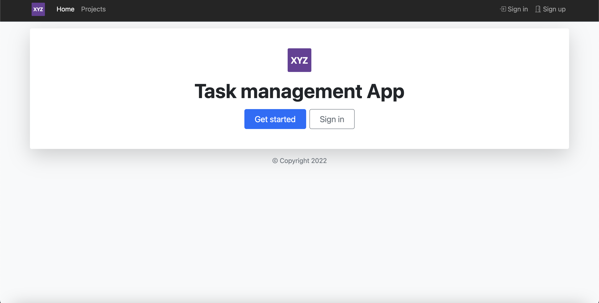

# TodoApp - frontend

### Description

A task management frontend Angular application with JWT token based authentication and authorization (refresh + access token).

### Features

**This project include:**
- Simple UI built with Bootstrap library
- Multiple components
- Routing
- Redirection after signing in
- Form data validation
- Auth Guard
- Auth Interceptor
- JWT token based authentication and authorization

**Users can:**
- Sign up
- Sign in
- Change password
- Create and manage projects
- Create and manage tasks
- View and sort tasks

### Sample UI screenshots

**Home**

**Sign in**

**Projects**

**Add task**

### Technologies and libraries

- Angular Framework v12.2.9
- Typescript
- HTML
- CSS
- Bootstrap v5.0